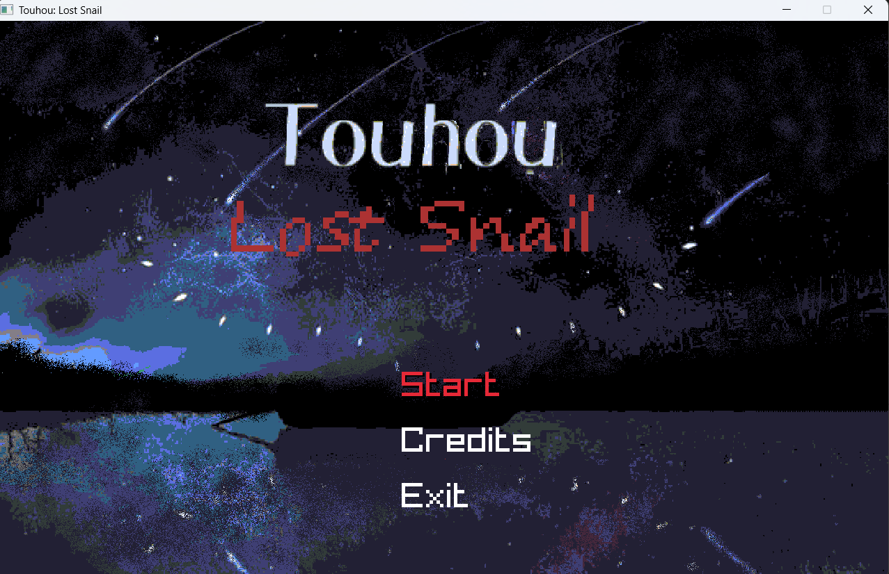
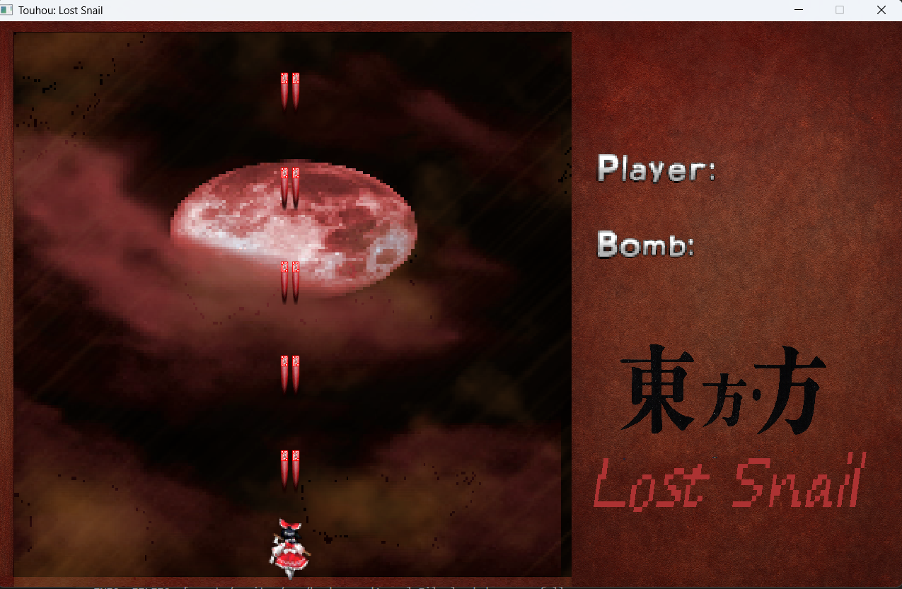

# 🐌 Touhou: Lost Snail

**Touhou: Lost Snail** é um _fangame_ inspirado na série **Touhou Project**, criado com C e a biblioteca Raylib.
O jogo está em desenvolvimento e busca recriar a essência dos bullet hells clássicos da série, com uma história simples com a protagonista Hachikuji Mayoi, a caracol perdida que desperta misteriosamente em Gensokyo.

---

## 🕹️ Sobre o Jogo

Em Touhou: Lost Snail, o jogador assume o controle de **Hachikuji Mayoi**, que inexplicavelmente desperta em Gensokyo.
Após ela vagar sem rumo, ela se encontra com a Flandre Scarlet da Mansão do Demônio escarlate, que quer "brincar" com sua nova amiga. Mas para Flandre, uma brincadeira é sempre algo destrutivo.

O jogo mistura:

- Bullet hells frenéticos com padrões de tiros complexos

- Estilo visual inspirado em Touhou Project e Monogatari Series

- Trilha sonora temática

---

## ⚙️ Estado Atual

🚧 **Status:** Em desenvolvimento (fase inicial)

Atualmente, o jogo conta com:

- Sistema de jogador funcional (movimentação, sprites e tiro básico)
- Menu inicial e lógica de transição de telas

Próximas etapas:

- Implementar inimigos e padrões de ataque
- Criar sistema de colisão e pontuação
- dicionar trilha sonora e efeitos sonoros
- Refinar interface e menus

---

## 🧰 Tecnologias Utilizadas

- Linguagem: C
- Framework gráfico: Raylib

- Ferramentas auxiliares:

    - Visual Studio Code

    - GCC / MinGW (compilação)

    - Aseprite (arte e sprites)

## 🖼️ Capturas de Tela

--- 

## 🔮 Futuro

O objetivo é criar uma experiência fiel ao espírito de Touhou, mas com uma personalidade própria, para nossa cadeira
de PIF, queremos fazer um jogo casual e divertido para as pessoas e que espalhe a magia de Touhou Project para todos conhecerem
essa obra incrível.

---

## 👾 Créditos

Desenvolvimento: 

- Luiz Gonzaga
- Marco Aurélio
- Walter Maia

Inspiração:

- Touhou Project (Team Shanghai Alice)
- Monogatari Series (Nisio Isin / Shaft)

## ⚠️ Aviso Legal

Este projeto é um fangame não comercial, criado apenas para fins de estudo e homenagem.
Todos os direitos de Touhou Project pertencem a ZUN / Team Shanghai Alice.
