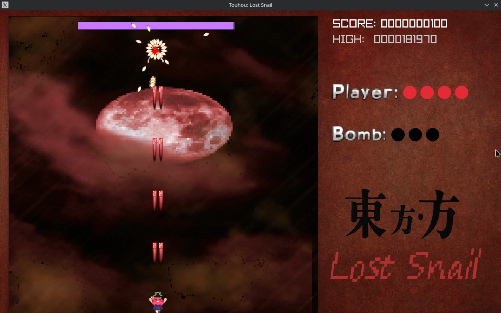

# Touhou: Lost Snail

**Touhou: Lost Snail** é um fan-game de Touhou Project, desenvolvido em C utilizando a biblioteca Raylib, o jogo é um bullet hell no estilo dos Touhou clássicos, onde nossa protagonista **Mayoi** lutará contra **Flandre Scarlet**, a irmã do Demônio Escarlate. É um jogo simples, 2 nonspells e 2 spellcards, feito para a cadeira de Programação Imperativa Funcional de minha faculdade, e também uma carta de amor a franquia original.

---

## Instruções de compilação

### Arch Linux

1. Primeiramente instale as ferramentas básicas de desenvolvimento:
```bash
sudo pacman -S base-devel
```
Isso instala gcc, git e make.

2. Instalar raylib com suas dependencias:
```bash
sudo pacman -S raylib
```

3. Clonar meu repositório do github:
```bash
git clone git@github.com:Nobutann/TouhouLostSnail.git
```
ou
```bash
git clone https://github.com/Nobutann/TouhouLostSnail.git
```

4. Ir para o diretório do projeto:
```bash
cd TouhouLostSnail
```

5. Rodar o jogo:
```bash
make run
```

---

## Como jogar

O jogo é um shmup simples, com apenas um inimigo e uma saraivada de balas para desviar.

### Teclas:
- Setas se movem para as direções apontadas(esquerda, direita, cima, baixo).
- Use **X** para disparar a bomba.
    - A bomba limpa todas as balas da tela e tira um pouco da vida do boss.
- Use **Z** para atirar.
- **Modo foco**:
    - Segurar a tecla **ShiftEsquerdo** fará você entrar no *modo foco* que deixa o personagem mais lento, permitindo melhor controle, e deixa visível a hitbox verdadeira da personagem.

### Score:
O score aumenta passivamente conforme você sobrevive, mas você ganha bônus ao fazer *graze*, ou seja, passar perto de balas sem ser atingido, e também ao passar de fase do boss, com bônus maior para as **Spell Cards**.

### Spell Cards:
Spell Card é uma fase especial em que o boss fica parado e lança uma pattern de tiros muito mais complexo e difícil de se desviar, ele também possui mais vida nesse estado, passar desse tipo de fase concede bônus adicional.

## Vídeo demonstrativo do jogo

[](https://youtu.be/jxpwtQ4GQNM)

---

## Créditos

